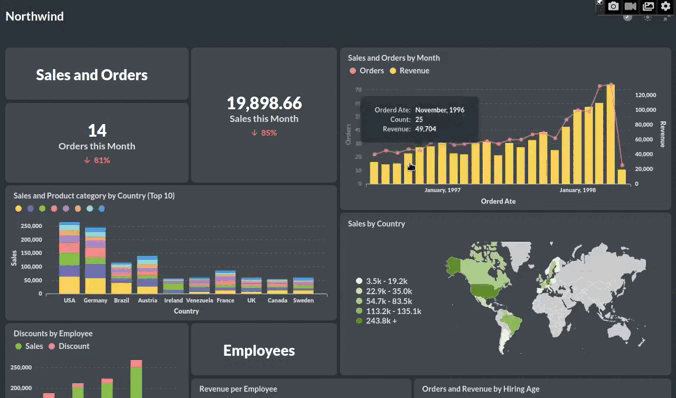
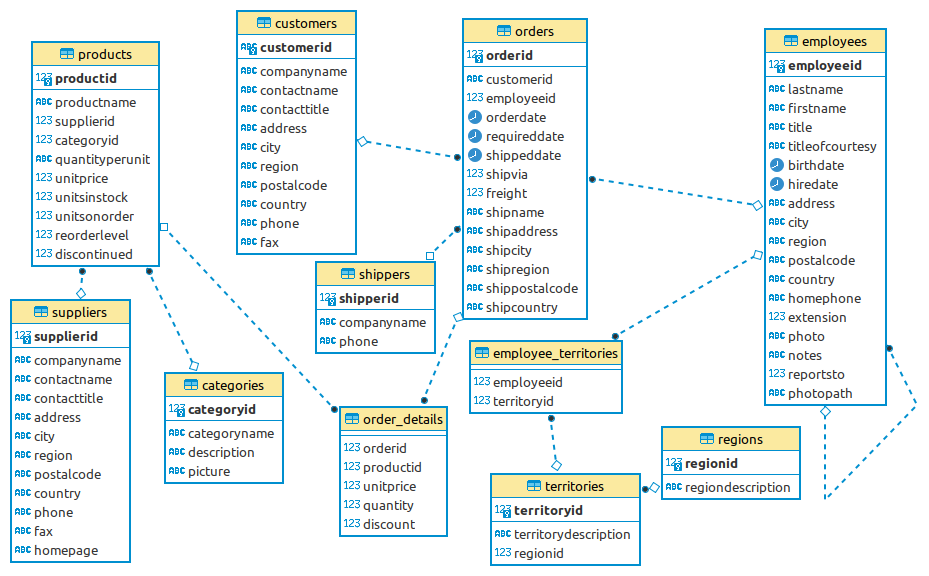

In this project, I built a dashboard summarizing the Northwind Database. It is a sample database that is shipped along with Microsoft Access. The data is about “Northwind Traders”, a fictional company. The database contains all sales transactions between the company and its customers as well as purchases from Northwinds suppliers.

[Link](http://ec2-3-123-142-216.eu-central-1.compute.amazonaws.com/public/dashboard/72416e7d-626e-49e7-a224-a499ff1454c2) to the Dashboard

